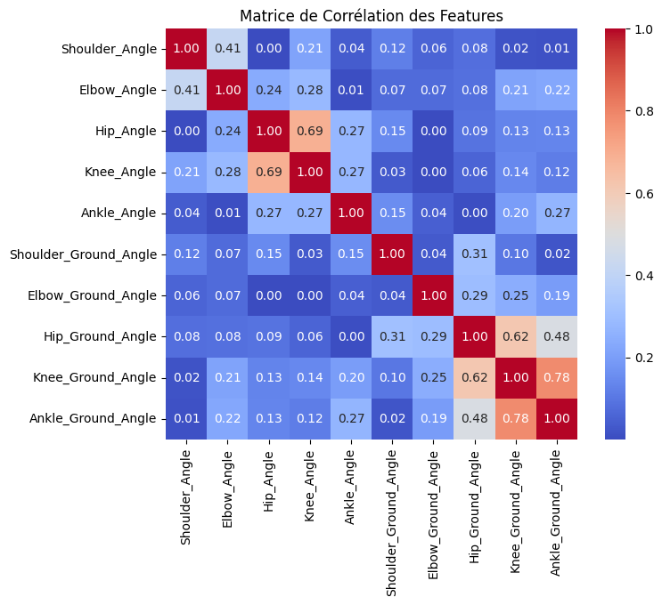

# Exploratory-Data-Analysis (EDA)

 This work is licensed under a <a rel="license" href="http://creativecommons.org/licenses/by-nc-nd/4.0/">Creative Commons Attribution-NonCommercial-NoDerivatives 4.0 International License</a>.

---

## **Project Overview**

This project focuses on performing an exploratory data analysis (EDA) on a new dataset related to sports exercises. The dataset consists of joint angle measurements taken during various specific sports exercises. The objective is to analyze the data, interpret patterns, and identify relationships between different features. This analysis also includes using the t-SNE method to visualize clusters and evaluate the dataset's characteristics. Furthermore, there is a bonus section where machine learning models like Random Forest and K-Nearest Neighbors (KNN) are tested for classification tasks.

The repository contains:

 - A research notebook EDA_Project.ipynb detailing the data analysis, visualizations, and model implementation.

---

[Installation and Execution](#installation) •
[Contributions](#contributions)

## Features

 - Data type analysis to understand the structure, quality, and characteristics of the dataset.

 - In-depth exploration of features and their interactions using statistical methods and visualizations.

 - Application of t-SNE to reduce dimensionality and visualize clusters.

 - Machine learning classification models (Random Forest and KNN) applied as a bonus challenge.

## Table of Contents

- [Installation](#installation)
  - [Pre-requisites](#pre-requisites)
  - [Compilation](#compilation)
- [EDA Section](#eda-section)
  - [Dataset Overview](#dataset-overview)
  - [Data Type Analysis](#data-type-analysis-(what-?))
  - [Understanding the Features](#understanding-the-features-(how-?))
  - [t-SNE and Evaluation](#t-SNE-and-Evaluation)
  - [Machine Learning Classification](#(bonus)-machine-learning-classification)
- [Contributions](#contributions)
  - [Authors](#authors)
  - [Version control](#version-control)
  - [History](#history)

# Installation
[(Back to top)](#table-of-contents)

## Pre-requisites

Make sure you have Python installed and a tool to read Jupyter Notebooks.

Requirements are included in the notebook.

# EDA Section
[(Back to top)](#table-of-contents)

## Dataset Overview

The dataset used in this analysis is sourced from the Exercise Detection Dataset available on Kaggle. It contains joint angle measurements collected during various sports exercises. Each sample in the dataset represents a snapshot of a specific exercise, capturing joint angles across multiple frames or moments of the exercise. This dataset offers the opportunity to explore the relationships between the various joint angles and potentially classify different types of exercises based on the patterns in the angles.

## Data Type Analysis (What ?)

In this section, we focus on understanding the structure of the dataset, its type, and the overall quality of the data. The goal is to answer the question: "What are the characteristics of the data we're working with?"

Here, we will:

 - Inspect the data types of each feature.
 - Check for missing values, outliers, and data integrity.
 - Provide initial insights into the composition and structure of the dataset.

*example of data visualization*

## Understanding the Features (How ?)

In this part, the emphasis is on interpreting the features and understanding their relationships. The objective is to answer: "How do these variables interact with each other?"

We will:

 - Perform statistical analysis to summarize the features.
 - Create visualizations (e.g., pairplots, correlation matrices) to identify patterns and dependencies.
 - Discuss potential interactions between features that could be significant for further analysis.

*correlation matrix ...*

*...and visualization by features*

## t-SNE and Evaluation

t-SNE (t-Distributed Stochastic Neighbor Embedding) is used to reduce the dimensionality of the data and visualize any potential clusters. The question we aim to answer here is: "Why use t-SNE, and what are its limitations?"

Key steps include:

 - Apply t-SNE on the raw data to identify clusters and relationships.
 - Evaluate the quality of the clusters and interpret the results.
 - Address the limitations of t-SNE, such as its sensitivity to hyperparameters.

 
*example of t-sne result*

## (Bonus) Machine Learning Classification

In this bonus section, we apply machine learning models to solve a classification problem using the dataset. We will focus on:

 - Random Forest: A robust model known for its high performance in classification tasks.
 - K-Nearest Neighbors (KNN): A simple yet effective classification algorithm to compare with Random Forest's performance.

 
*feature rankings with random forest*

# Contributions
[(Back to top)](#table-of-contents)

## Authors

- [**Remi Jorge**](https://github.com/RemiJorge)
- [**Alexandre Deloire**](https://github.com/alexdeloire)
- [**Jiayi He**](https://github.com/JiayiHE95)

---

This README provides a structured and professional overview of the Remote-Sensing-Classification project, ensuring clarity and ease of navigation for users and contributors. For additional details, refer to the full Report.pdf and accompanying documentation.